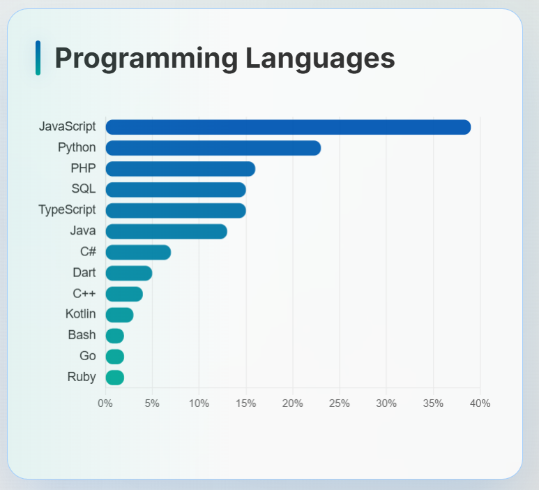
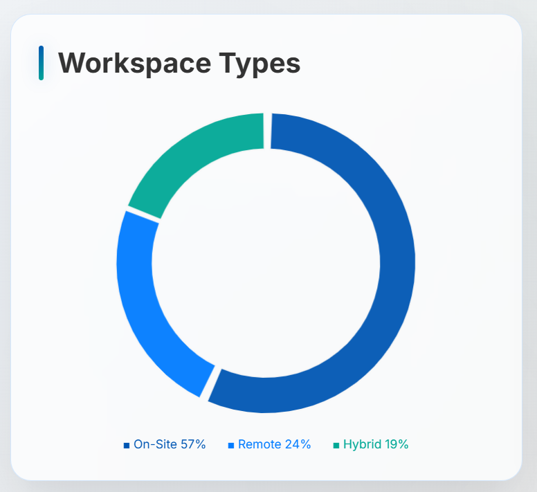
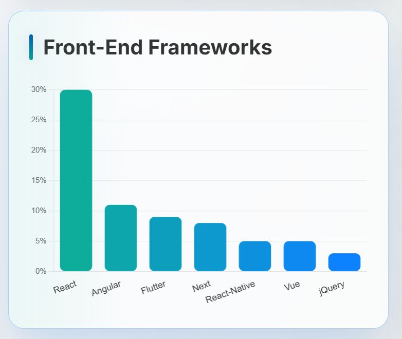
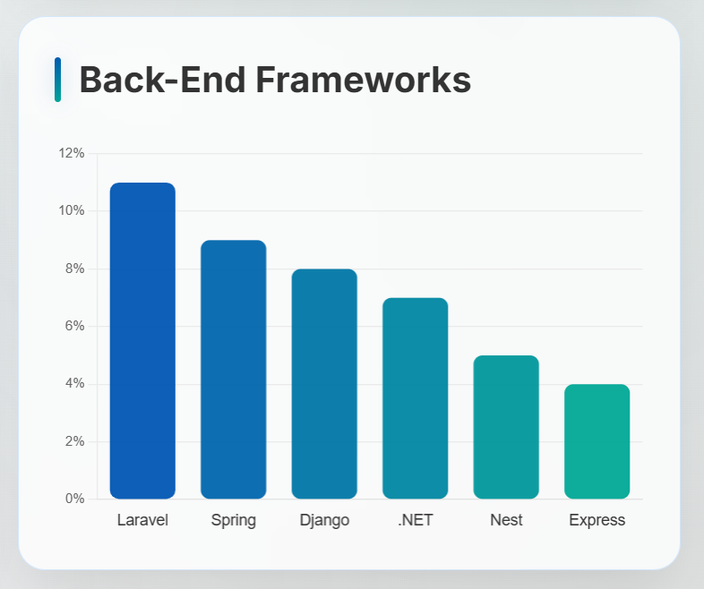
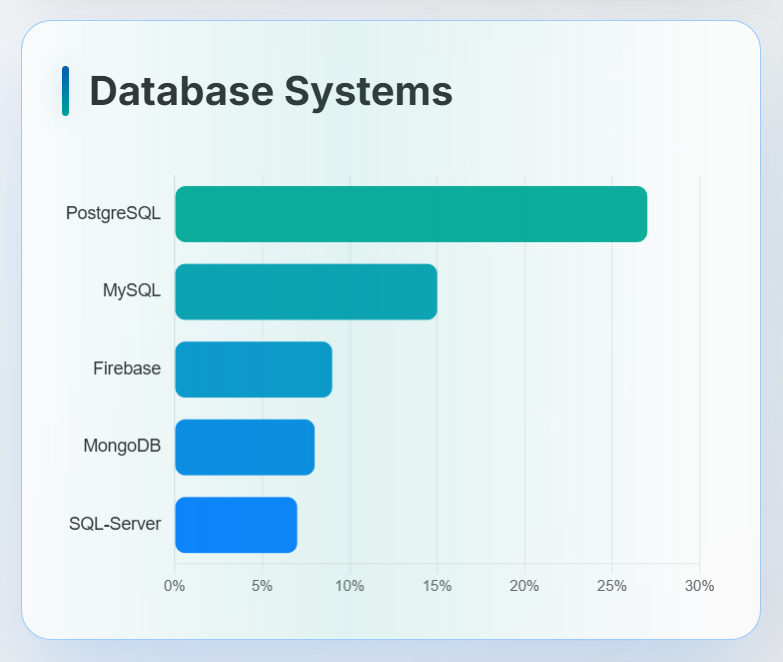
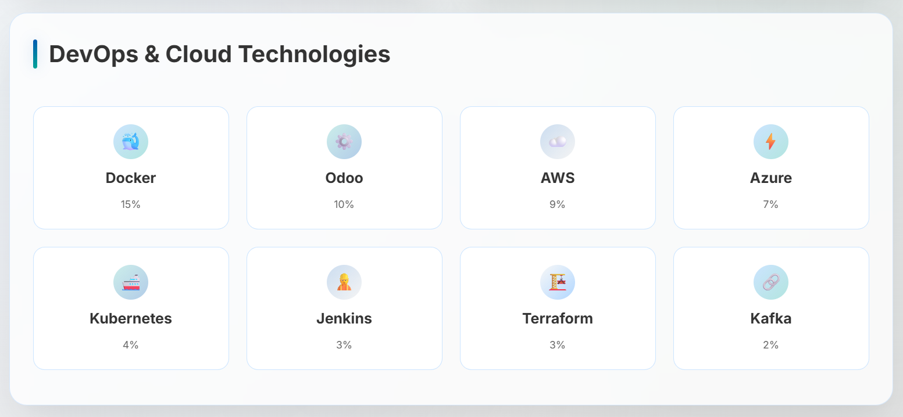

# Huh?

So... I just wrapped up my degree 🎓 and I am starting a new job hunt. To get a feel for what’s hot (or not) in the Algerian dev job market, I did some good ol’ web-scraping ;) and dug through job posts like a raccoon. 🦝

And unlike some of you selfish-ass mfs who never share shit, I actually decided to post my findings here.

# Quick Peek

I analyzed over 100 job posts from May 2025, all aimed at Algerian developers. Then counted how often different techs showed up and made some nice lil’ charts:

<table>
  <tr>
    <td></td>
    <td></td>
  </tr>
  <tr>
    <td></td>
    <td></td>
  </tr>
  <tr>
    <td></td>
    <td></td>
  </tr>
</table>
<table>
  <tr>
    <td></td>
  </tr>
</table>

# Fun Fax

This webpage was built with a **Single AI Prompt** using an AI agent/system developed and designed by a friend.

- **Time spent:** 6 mins (probably more)

- **Money wasted:** $0.13

- **Efforts made:** Typed one prompt

**Final result:** [Job Market Analysis - Algeria](https://alex17ryan.github.io/A-Job-Market-Analysis/)

Hell, even this README is AI generated 🥸
